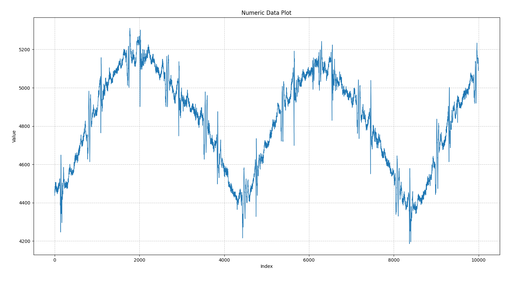

# Digital-FIR-filter-in-FPGA
Design, Implementation and Validation of Digital Filter on Lattice iCE40UP5k FPGA

A hardware implementation of a 64-tap Finite Impulse Response (FIR) filter on Lattice iCE40UP5K FPGA.  
This project demonstrates digital signal processing in hardware using fixed-point arithmetic, FSM control, and BRAM interfacing, along with optimized resource utilization on a low-cost FPGA.

### Filter Architecture
- Features a 64-tap FIR filter
- Implemented in Verilog
- Q16.16 fixed-point arithmetic   
- Dual-port BRAM for coefficient & data storage  
- Clock domain crossing logic  
- Validated its functionality on Lattice iCE40UP5k FPGA  

To perform MAC operations, the FPGA's on board DSP blocks are used. 

📌 Results

The filter was verified via: 
Functional simulation 
Successful programming and testing on an iCE40UP5k FPGA

Note: This project was developed as part of my project work at TUHH and demonstrates practical skills in FPGA development and signal processing.
