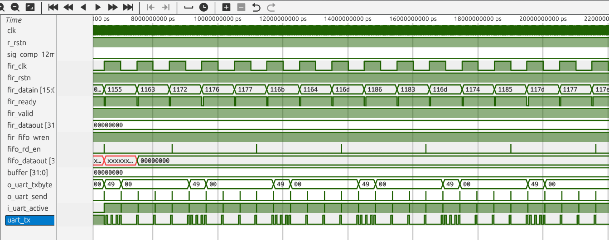
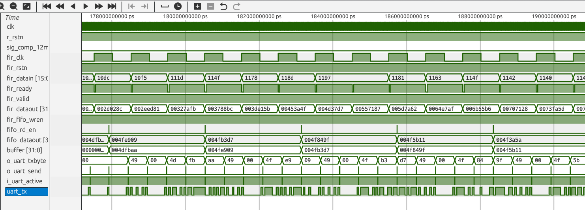
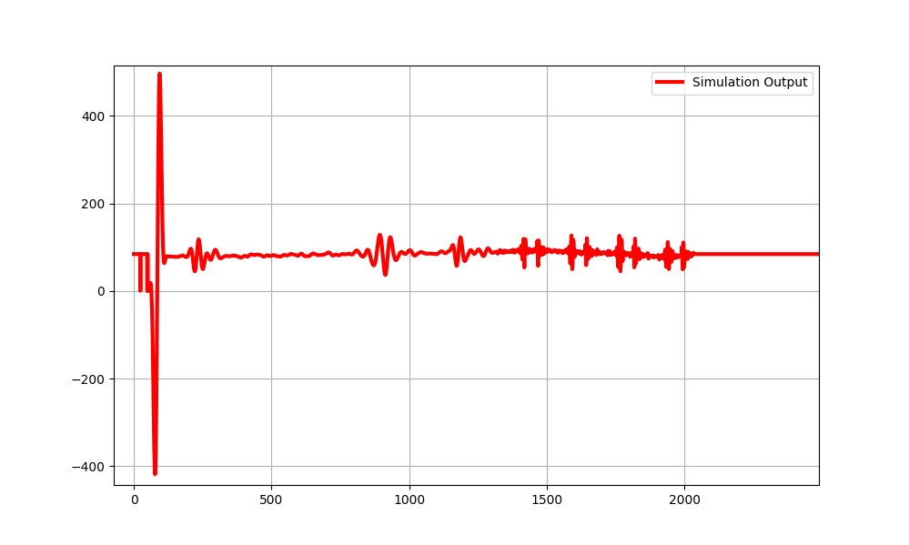
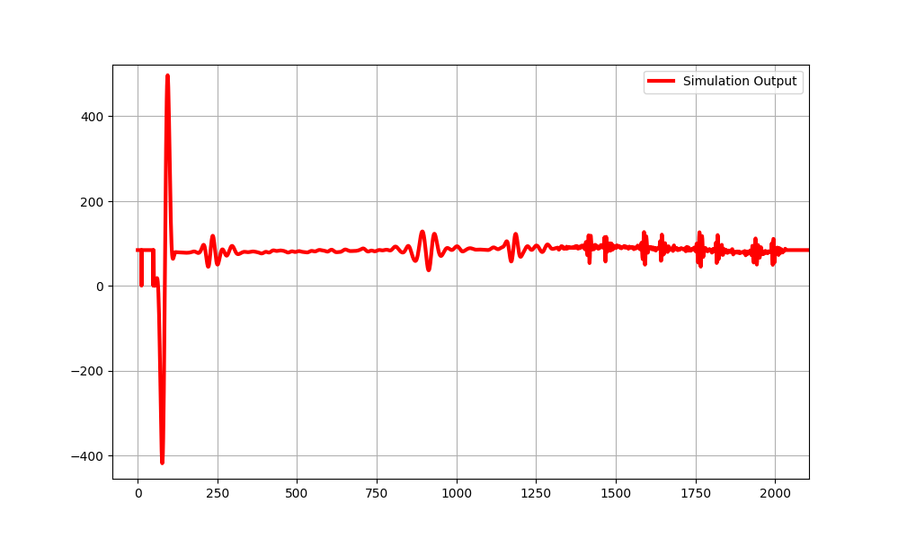

## Block Diagram


## Simulation waveform





Simulation works fine and the attached signal output. 

## Testbench output 


## Synthesize output
Upon synthesis I got the following outputs

### With flip-flops as delay line (shift register)
In this flip-flops are used as delay line, but since 64 x 16 which is costly on the FPGA resources, there is an alternate approach as well.
Corresponding file is located in `src/fir/fir_multiplex_ff_shiftreg.v`



Resource utilization

```
❯ make build
mkdir -p ./build
yosys -p  'synth_ice40 -dsp -top top -blif ./build/top.blif -json build/top.json' -ql ./build/top.yslog src/top.v src/uart/uart_tx.v src/uart/uart_rx.v src/bram/bram.v src/bram/dual_port_bram.v src/fir/filter_input_bram.v src/fir/fir_multiplex.v src/async_fifo/fifo_mem.v src/async_fifo/synchronizer.v src/async_fifo/read_ptr.v src/async_fifo/write_ptr.v src/async_fifo/async_fifo.v src/clock/clock.v src/clock/rst_synchronizer.v
Warning: wire '\prev_result' is assigned in a block at src/fir/fir_multiplex.v:228.7-228.23.
Warning: Replacing memory \delay_line with list of registers. See src/fir/fir_multiplex.v:240
src/fir/fir_multiplex.v:228: Warning: Identifier `\prev_result' is implicitly declared.
nextpnr-ice40 --up5k --package sg48 --json build/top.json --pcf pins.pcf --asc build/top.asc -ql ./build/top.nplog
Warning: unmatched constraint 'uart_rx' (on line 19)
1 warning, 0 errors
icepack build/top.asc build/top.bin
./resrc_util.sh
Info:            ICESTORM_LC:    2116/   5280    40%
Info:           ICESTORM_RAM:      23/     30    76%
Info:                  SB_IO:       3/     96     3%
Info:                  SB_GB:       8/      8   100%
Info:           ICESTORM_PLL:       0/      1     0%
Info:            SB_WARMBOOT:       0/      1     0%
Info:           ICESTORM_DSP:       1/      8    12%
Info:         ICESTORM_HFOSC:       0/      1     0%
Info:         ICESTORM_LFOSC:       0/      1     0%
Info:                 SB_I2C:       0/      2     0%
Info:                 SB_SPI:       0/      2     0%
Info:                 IO_I3C:       0/      2     0%
Info:            SB_LEDDA_IP:       0/      1     0%
Info:            SB_RGBA_DRV:       0/      1     0%
Info:         ICESTORM_SPRAM:       0/      4     0%
```

### With flip-flops BRAM as delay line (shift register)
Here the logic count has considerably reduced significantly. Similarly 1 EBR is used extra for functioning as shift register
Corresponding file is located in `src/fir/fir_multiplex.v`




Resource utilization
```
❯ make build
mkdir -p ./build
yosys -p  'synth_ice40 -dsp -top top -blif ./build/top.blif -json build/top.json' -ql ./build/top.yslog src/top.v src/uart/uart_tx.v src/uart/uart_rx.v src/bram/bram.v src/bram/dual_port_bram.v src/fir/filter_input_bram.v src/fir/fir_multiplex.v src/async_fifo/fifo_mem.v src/async_fifo/synchronizer.v src/async_fifo/read_ptr.v src/async_fifo/write_ptr.v src/async_fifo/async_fifo.v src/clock/clock.v src/clock/rst_synchronizer.v
nextpnr-ice40 --up5k --package sg48 --json build/top.json --pcf pins.pcf --asc build/top.asc -ql ./build/top.nplog
Warning: unmatched constraint 'uart_rx' (on line 19)
1 warning, 0 errors
icepack build/top.asc build/top.bin
./resrc_util.sh
Info:            ICESTORM_LC:     873/   5280    16%
Info:           ICESTORM_RAM:      24/     30    80%
Info:                  SB_IO:       3/     96     3%
Info:                  SB_GB:       8/      8   100%
Info:           ICESTORM_PLL:       0/      1     0%
Info:            SB_WARMBOOT:       0/      1     0%
Info:           ICESTORM_DSP:       1/      8    12%
Info:         ICESTORM_HFOSC:       0/      1     0%
Info:         ICESTORM_LFOSC:       0/      1     0%
Info:                 SB_I2C:       0/      2     0%
Info:                 SB_SPI:       0/      2     0%
Info:                 IO_I3C:       0/      2     0%
Info:            SB_LEDDA_IP:       0/      1     0%
Info:            SB_RGBA_DRV:       0/      1     0%
Info:         ICESTORM_SPRAM:       0/      4     0%

```