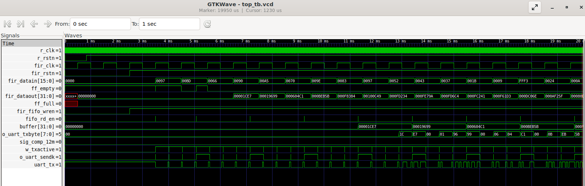
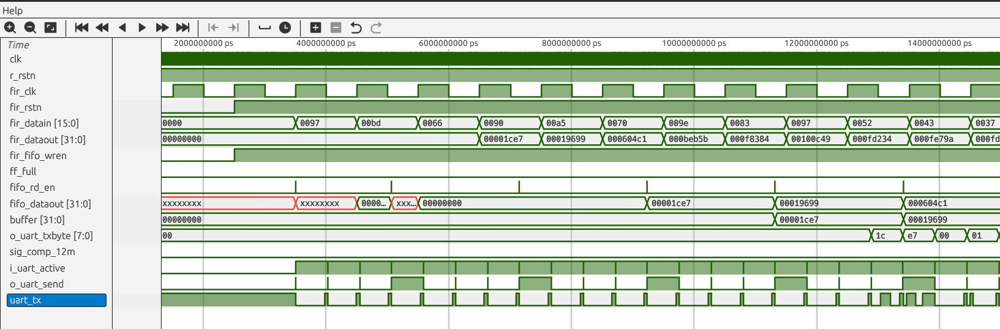
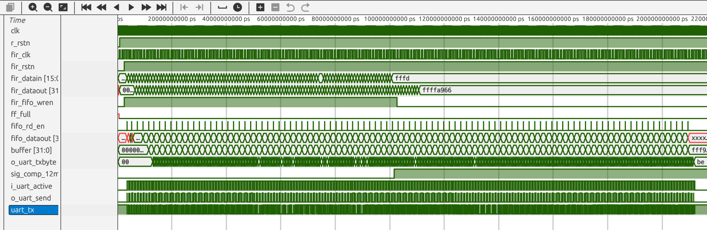
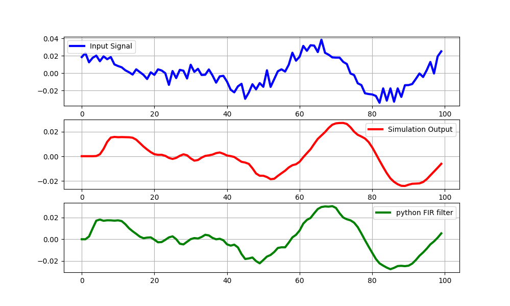

# Transposed FIR Synthesizable Code

## Block Diagram


This project directory contains the synthesizable code.
- `top.v` is the top module where all the signals are controlled and modules are instantiated.
-  `filter_input.v` loads `sig.txt` to the fpga BRAM and provides the signal to the filter at a sampling frequency of 1KHz.
- `transposed_fir.v` performs the FIR filter operation.
- `clock.v` to generate 1KHz clock from 12MHz oscillator.
-  Clock domain crossing is implemented with asynchronous FIFO present in `async_fifo.v` module and the synchronizers.
- `uart_tx.v` provides the uart output on 19200 baud rate.

Tap Values used in this filter
```     
      coeff[0] <= 16'b1111111111111000;
      coeff[1] <= 16'b0000000000110001;
      coeff[2] <= 16'b0000001001110100;
      coeff[3] <= 16'b0000011100000001;
      coeff[4] <= 16'b0000100110011010;
      coeff[5] <= 16'b0000011100000001;
      coeff[6] <= 16'b0000001001110100;
      coeff[7] <= 16'b0000000000110001;
      coeff[8] <= 16'b1111111111111000;

```
I could not load the tap values with the readmemb also I could not assign a blockRAM. Suggest me a better way to implement this.

Simulation output








DSP Utilization

```
make build
mkdir -p ./build
yosys -p 'synth_ice40 -dsp -top top -blif ./build/top.blif -json build/top.json' -ql ./build/top.yslog src/top.v src/uart/uart_rx.v src/uart/uart_tx.v src/async_fifo/read_ptr.v src/async_fifo/fifo_mem.v src/async_fifo/async_fifo.v src/async_fifo/write_ptr.v src/async_fifo/synchronizer.v src/fir/filter_input.v src/fir/transposed_fir.v src/clock/clock.v src/clock/clock_divider.v src/clock/rst_synchronizer.v src/bram/bram.v

Info: Device utilisation:
Info:            ICESTORM_LC:     727/   5280    13%
Info:           ICESTORM_RAM:       3/     30    10%
Info:                  SB_IO:       3/     96     3%
Info:                  SB_GB:       8/      8   100%
Info:           ICESTORM_PLL:       0/      1     0%
Info:            SB_WARMBOOT:       0/      1     0%
Info:           ICESTORM_DSP:       4/      8    50%
Info:         ICESTORM_HFOSC:       0/      1     0%
Info:         ICESTORM_LFOSC:       0/      1     0%
Info:                 SB_I2C:       0/      2     0%
Info:                 SB_SPI:       0/      2     0%
Info:                 IO_I3C:       0/      2     0%
Info:            SB_LEDDA_IP:       0/      1     0%
Info:            SB_RGBA_DRV:       0/      1     0%
Info:         ICESTORM_SPRAM:       0/      4     0%

```


Got 8 bits output through UART which is then concatenated to 32 bits and plotted with python. 
Output waveform obtained through UART



